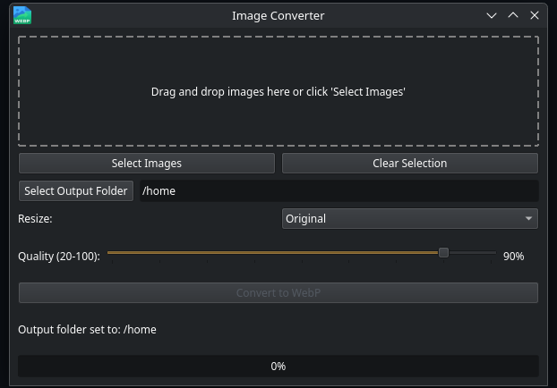

# Image to WebP Converter

Image to WebP Converter is a user-friendly desktop application that allows you to easily convert PNG, JPG, JPEG, BMP, GIF, and TIFF images to the WebP format. With its intuitive interface and customizable options, you can quickly optimize your images for web usage while maintaining control over the output quality and size.

## Features

*   Drag and drop images directly into the application window.
*   Select multiple images for batch conversion.
*   Choose from predefined size options: Original, Small (50%), Medium (75%), Large (150%).
*   Adjust the output quality (20-100): Lower values result in smaller file sizes with potentially more loss, while higher values retain more quality.
*   Option for lossless conversion (100% quality).
*   Progress bar to track the conversion progress.
*   Option to select a custom output folder for converted images.
*   Clear status updates during the conversion process.

## Installation

### Linux

A shell script (`install.sh`) is provided to help with the installation on Linux systems. This script will:

*   Create an installation directory in `~/.local/share/ImageConverter`.
*   Set up a Python virtual environment and install the necessary dependencies (PyQt6, Pillow).
*   Copy the application script and icon (if present) to the installation directory.
*   Create a launcher script in `~/.local/bin` so you can run the application from the terminal.
*   Create a desktop entry file in `~/.local/share/applications` so the application appears in your desktop environment's application menu.

**Usage (Linux):**

1.  Save the `install.sh` script and the `image_converter_gui.py` script (and optionally an `icon.png` or `icon.ico` file) in the same directory.
2.  Open a terminal and navigate to that directory.
3.  Run the installation script:
    \`\`\`bash
    chmod +x install.sh
    ./install.sh
    \`\`\`
4.  Follow the on-screen instructions. You may need to log out and log back in for the application menu entry to appear.
5.  To uninstall, run the script again with the `--uninstall` flag:
    \`\`\`bash
    ./install.sh --uninstall
    \`\`\`

### Windows

For Windows, we recommend building a standalone executable using PyInstaller. This approach avoids the need to install Python and dependencies separately for users.

**Building a Windows Executable (Guide for Developers):**

1.  **Install Dependencies:** If you haven't already, install PyQt6, Pillow, and PyInstaller:
    \`\`\`bash
    pip install PyQt6 Pillow pyinstaller
    \`\`\`
2.  **Navigate to the Script Directory:** Open a command prompt or PowerShell and navigate to the directory containing your `image_converter_gui.py` script and any icon files (e.g., `icon.ico`).
3.  **Run PyInstaller:** Use the following command to create the executable. Adjust the `--icon` option if you have an icon file:
    \`\`\`bash
    pyinstaller --onefile --windowed --icon=icon.ico image_converter_gui.py
    \`\`\`
    *   `--onefile`: Creates a single executable file.
    *   `--windowed` or `-w`: Prevents a console window from appearing.
    *   `--icon=icon.ico`: Specifies the path to your application icon file. Replace `icon.ico` with the actual filename if different.
4.  **Locate the Executable:** After PyInstaller completes, the executable file (`image_converter_gui.exe`) will be located in the `dist` subdirectory.

You can then distribute the `image_converter_gui.exe` file to Windows users.

## Usage

### Running the Application

*   **Linux:** After installation, you can run the application by typing `image-converter` in your terminal or by finding "ImageConverter" in your desktop application menu.
*   **Windows:** Double-click the `image_converter_gui.exe` file located in the `dist` subdirectory (after building with PyInstaller).

### Converting Images

1.  Launch the Image to WebP Converter application.
2.  Drag and drop the desired image files (PNG, JPG, JPEG, BMP, GIF, TIFF) into the application window, or click the "Select Images" button to choose images manually.
3.  Choose the desired output size from the "Resize" dropdown menu.
4.  Adjust the output quality using the slider (20-100). Check the "Lossless" option for 100% quality and no compression artifacts.
5.  Click the "Select Output Folder" button to choose where the converted WebP files will be saved. If no folder is selected, a "converted\_webp" folder will be created in your home directory by default.
6.  Click the "Convert to WebP" button to start the conversion process.
7.  The progress bar will indicate the overall conversion progress and the status label will show information about the current file being processed.
8.  Once the conversion is complete, a message will be displayed, and the converted images will be saved in the specified output folder.

## System Requirements

*   **Linux:** Any modern Linux distribution with Python 3 and basic development tools.
*   **Windows:** Windows 7 or later (Windows 10 or later recommended).

## Contributing

Contributions are welcome! If you encounter any issues or have suggestions for improvements, please open an issue or submit a pull request.

## License

This project is licensed under the MIT License.

## Acknowledgements

*   PyQt6 - Python bindings for the Qt application framework
*   Pillow - Python Imaging Library
*   PyInstaller - Python library for creating standalone executables (for Windows)

## Contact

For any questions or inquiries, please contact dev@siliconsquire.com.

